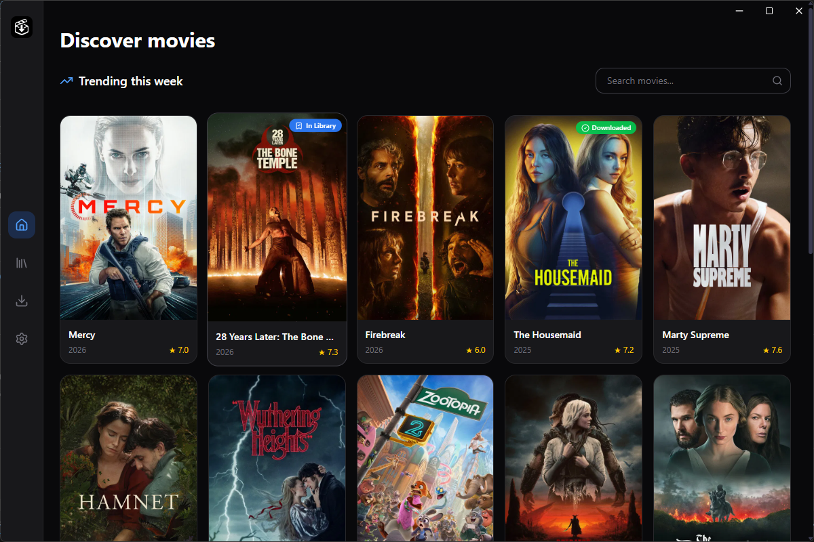
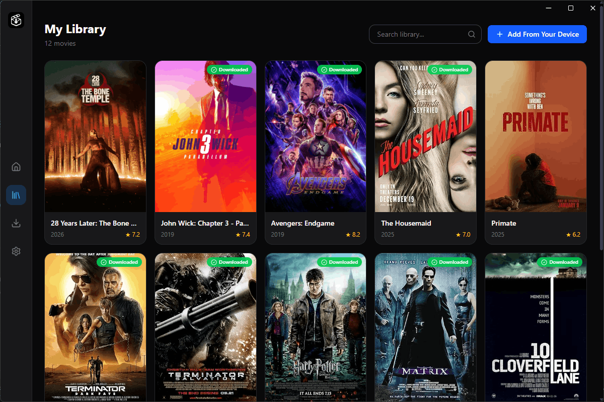
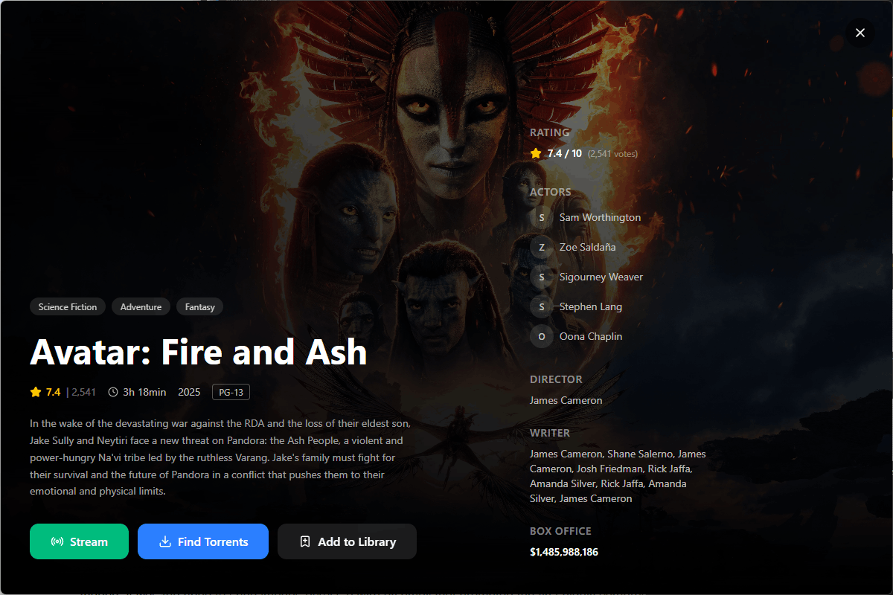
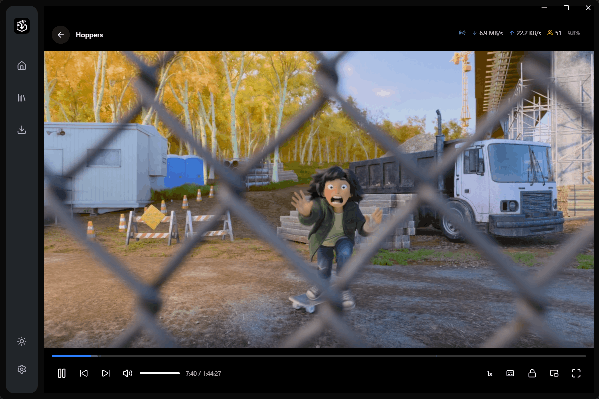
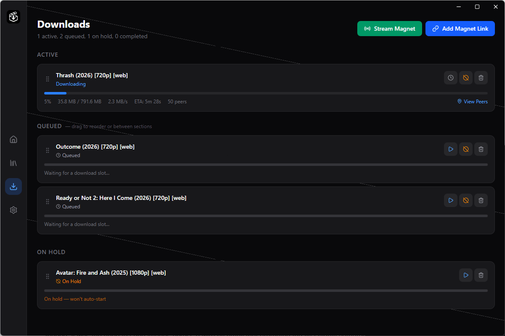
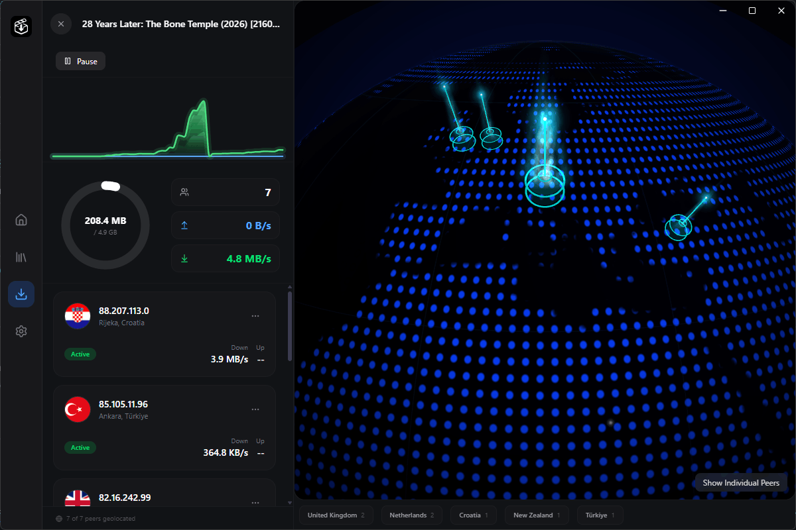

<p align="center">
  
</p>

<h1 align="center">Cerberus</h1>

<p align="center">
  A modern desktop torrent client and movie manager built with Electron, React, and TypeScript.
</p>

<p align="center">
  
  
  
  
  
</p>

<p align="center">
  
  
</p>
<p align="center">
  
  
</p>
<p align="center">
  
  
</p>

---

## Overview

Cerberus is an all-in-one desktop application for discovering, downloading, streaming, and watching movies. It combines a torrent client powered by WebTorrent with a rich movie discovery interface backed by TMDb and YTS, a personal movie library, a built-in video player with subtitle support, real-time download analytics — including a 3D peer globe and live speed charts — and the ability to stream torrents directly without waiting for the full download.

## Features

- **Movie Discovery** — Search and browse trending movies via the TMDb API. View detailed metadata including cast, crew, ratings, plot summaries, and backdrop images. Torrent availability is checked automatically before displaying results.
- **Torrent Search & Download** — Search for torrents through the YTS source (pluggable architecture for additional sources). Start downloads from magnet links with pause, resume, cancel, and delete controls. Duplicate magnet detection compares info-hashes (not raw magnet text) to prevent re-downloading the same torrent.
- **Resilient Torrent Engine** — Modular subsystem with an explicit per-torrent state machine, magnet sanitization (curated tracker list, stripped user trackers/web seeds), debounced re-announce coordinator, stall watchdog with automatic queue demotion, metadata-resolution timeout with retry backoff, and pre-flight disk-space checks. Pause is a real pause — the wire pool, bitfield, and rarity map survive across pause/resume.
- **Download Queue** — Configurable max concurrent downloads (default: 2). Priority-based queue with reordering and hold/unhold support. Download state is persisted via a debounced, crash-safe JSON writer (atomic `.tmp` + rename) and automatically restored on app restart.
- **Torrent Streaming** — Stream torrents directly from a magnet link without downloading the full file first. Sequential download strategy with first/last piece prioritization for MP4 moov atom handling. Streaming runs on an isolated WebTorrent pool, so stopping a stream can never destroy the on-disk store of a download sharing the same info-hash.
- **Personal Library** — Automatically adds completed downloads to your library. Batch-import existing movies from your device — pick multiple files or a whole folder, and titles are auto-matched against TMDb by parsing release-tag noise (resolution, codec, group) out of the filename. Search and filter your collection. Smart video file resolution that searches subdirectories for the largest video file.
- **Built-in Video Player** — Watch movies directly inside the app with a custom HTML5 player featuring keyboard shortcuts, playback speed control (0.25×–2×), seek bar, and volume control. Alternatively, launch an external player of your choice (e.g., VLC, mpv).
- **Subtitles** — Search and download subtitles via two providers: OpenSubtitles and Subdl. Filter by language, auto-convert SRT to VTT for HTML5 playback (with encoding detection so non-UTF-8 releases like windows-1256 render correctly), and automatically discover local subtitle files (SRT, VTT, ASS, SSA, SUB) by matching them to the video's basename. Provider selection is configurable in Settings.
- **Real-time Download Analytics** — Live speed charts for upload and download bandwidth. Interactive 3D globe visualization showing peer locations worldwide. Per-peer stats including client name, speed, progress, and geolocation. Country-level peer distribution breakdown.
- **Local Video Server** — Built-in HTTP server with range-request support for seamless video streaming of local files (supports MP4, MKV, AVI, MOV, WebM, M4V, WMV).
- **Peer Geolocation** — Batch IP geolocation via ip-api.com supporting up to 100 IPs per request. Smart batching with debounce, in-memory caching, and automatic filtering of private/local IP addresses.
- **Auto-updates** — Background update checks every 6 hours via electron-updater. Surface available versions, release notes, and download progress in Settings, with one-click download and quit-and-install.
- **Light & Dark Themes** — Toggle between light and dark modes; preference is persisted across sessions.
- **Cross-platform** — Builds for Windows (NSIS installer), macOS (DMG), and Linux (AppImage, Snap, Deb).

## Tech Stack

| Layer            | Technology                                                                               |
| ---------------- | ---------------------------------------------------------------------------------------- |
| Framework        | [Electron](https://www.electronjs.org/) 39 + [electron-vite](https://electron-vite.org/) |
| Frontend         | [React](https://react.dev/) 19, [React Router](https://reactrouter.com/) 7               |
| Language         | [TypeScript](https://www.typescriptlang.org/) 5.9                                        |
| Styling          | [Tailwind CSS](https://tailwindcss.com/) 4, [Lucide Icons](https://lucide.dev/)          |
| State Management | [Zustand](https://zustand.docs.pmnd.rs/) 5                                               |
| Torrent Engine   | [WebTorrent](https://webtorrent.io/) 2                                                   |
| 3D Visualization | [Three.js](https://threejs.org/), [Cobe](https://cobe.vercel.app/)                       |
| Movie Data       | [TMDb API](https://www.themoviedb.org/documentation/api), [YTS API](https://yts.mx/api)  |
| Subtitles        | [OpenSubtitles API](https://www.opensubtitles.com/), [Subdl API](https://subdl.com/)     |
| Geolocation      | [ip-api.com](http://ip-api.com/) (batch endpoint)                                        |
| HTTP Requests    | [Axios](https://axios-http.com/)                                                         |
| Auto-updates     | [electron-updater](https://www.electron.build/auto-update)                               |
| Bundler          | [Vite](https://vite.dev/) 7                                                              |
| Component Dev    | [Storybook](https://storybook.js.org/) 10                                                |
| Linting          | [ESLint](https://eslint.org/) 9, [Prettier](https://prettier.io/)                        |
| Packaging        | [electron-builder](https://www.electron.build/)                                          |

## Prerequisites

- [Node.js](https://nodejs.org/) >= 18
- [npm](https://www.npmjs.com/) >= 9 (or your preferred package manager)
- A [TMDb API key](https://www.themoviedb.org/settings/api) (free) — required for movie discovery and metadata
- _(Optional)_ An [OpenSubtitles API key](https://www.opensubtitles.com/en/consumers) — for subtitle search and download via OpenSubtitles

## Getting Started

### 1. Clone the repository

```bash
git clone https://github.com/farhad-gh-dev/cerberus.git
cd cerberus
```

### 2. Install dependencies

```bash
npm install
```

### 3. Configure your TMDb API key

Launch the app and navigate to **Settings** to enter your TMDb API key, or manually create a `settings.json` file in Electron's per-OS user-data directory for Cerberus:

| OS      | Path                                             |
| ------- | ------------------------------------------------- |
| Windows | `%APPDATA%\cerberus\settings.json`                 |
| macOS   | `~/Library/Application Support/cerberus/settings.json` |
| Linux   | `~/.config/cerberus/settings.json`                 |

with the following contents:

```json
{
  "tmdbApiKey": "<YOUR_TMDB_API_KEY>"
}
```

### 4. Start development

```bash
npm run dev
```

## Available Scripts

| Script                    | Description                                        |
| ------------------------- | -------------------------------------------------- |
| `npm run dev`             | Start the app in development mode with hot-reload  |
| `npm run build`           | Type-check and build the app for production        |
| `npm run build:win`       | Build and package for Windows (NSIS installer)     |
| `npm run build:mac`       | Build and package for macOS (DMG)                  |
| `npm run build:linux`     | Build and package for Linux (AppImage, Snap, Deb)  |
| `npm run start`           | Preview the production build                       |
| `npm run typecheck`       | Run TypeScript type checking (Node + Web)          |
| `npm run lint`            | Lint the codebase with ESLint                      |
| `npm run format`          | Format the codebase with Prettier                  |
| `npm run storybook`       | Start Storybook for isolated component development |
| `npm run build-storybook` | Build a static Storybook site                      |

## Architecture

Cerberus follows Electron's multi-process architecture with a clear separation of concerns:

- **Main Process** — Hosts the modular torrent engine (download + isolated streaming pools), TMDb/YTS API calls, subtitle fetching (OpenSubtitles & Subdl), a local HTTP video server, IP geolocation, the auto-updater, and JSON-based persistence (debounced + crash-safe). IPC handlers expose these capabilities to the renderer.
- **Preload Script** — Provides a secure `window.api` bridge using Electron's `contextBridge`, exposing typed IPC methods without granting the renderer direct access to Node.js APIs.
- **Renderer Process** — A React SPA with client-side routing (HashRouter). Uses Zustand for state management (downloads, settings, theme, updater), Tailwind CSS for styling, Three.js/Cobe for the 3D peer globe, and a custom HTML5 video player with subtitle support.

```
src/
├── main/                       # Main process
│   ├── config/                 # Tracker lists, window configuration
│   ├── db/                     # JSON-based library persistence
│   ├── ipc/                    # IPC handlers (downloads, library, movies, settings,
│   │                           #   streaming, subtitles, torrents, updater)
│   ├── services/
│   │   ├── torrent/            # Modular torrent subsystem
│   │   │   ├── engine.ts             # Queue, activation, lifecycle orchestration
│   │   │   ├── session.ts            # Per-torrent runtime
│   │   │   ├── state.ts              # Explicit FSM
│   │   │   ├── pool.ts               # WebTorrent client pool (download)
│   │   │   ├── stream-engine.ts      # Isolated streaming pool
│   │   │   ├── announce-coordinator.ts # Debounced re-announce
│   │   │   ├── disk-guard.ts         # Pre-flight free-space check
│   │   │   ├── errors.ts             # Typed errors + classifier
│   │   │   ├── items.ts              # FSM-derived item snapshots
│   │   │   └── policies/             # Magnet sanitization, file selection,
│   │   │                             #   streaming piece priority
│   │   ├── cache.ts            # TTL cache w/ in-flight de-duplication
│   │   ├── json-writer.ts      # Debounced, crash-safe JSON persistence
│   │   ├── updater.ts          # electron-updater integration
│   │   ├── video-server.ts     # Local HTTP server with range-request support
│   │   ├── tmdb.ts, subdl.ts, opensubtitles.ts, geolocation.ts, library.ts, ...
│   │   └── sources/            # Pluggable torrent search sources (YTS, ...)
│   └── types/                  # TMDb types, WebTorrent declarations
├── preload/                    # Secure contextBridge API
├── renderer/                   # React frontend
│   └── src/
│       ├── components/         # UI components (player, globe, modals, download rows,
│       │                       #   settings sections, layout/top bars, etc.)
│       ├── hooks/              # Custom React hooks
│       ├── pages/              # Route pages (home, library, downloads, player, settings)
│       ├── stores/             # Zustand stores (downloads, settings, toast, theme, updater)
│       └── utils/              # Shared utilities
└── shared/                     # Types shared between main and renderer
```

## License

This project is provided as-is for personal and educational use.
